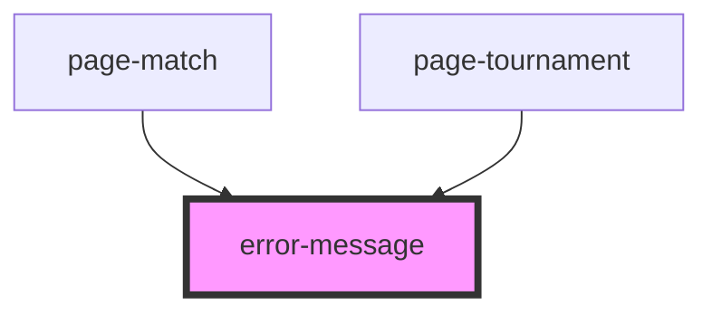

# error-message

<!-- Auto Generated Below -->

## Properties

| Property       | Attribute        | Description | Type      | Default     |
| -------------- | ---------------- | ----------- | --------- | ----------- |
| `goHomeButton` | `go-home-button` |             | `boolean` | `true`      |
| `message`      | `message`        |             | `string`  | `undefined` |

## Dependencies

### Used by

 - [page-match](../page-match)
 - [page-tournament](../page-tournament)

### Graph

----------------------------------------------

*Built with [StencilJS](https://stenciljs.com/)*
