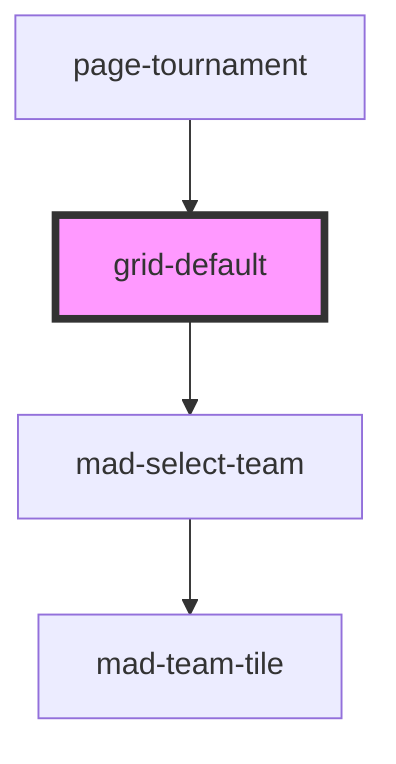

# grid-default

<!-- Auto Generated Below -->

## Properties

| Property       | Attribute       | Description | Type             | Default     |
| -------------- | --------------- | ----------- | ---------------- | ----------- |
| `tournamentId` | `tournament-id` |             | `null \| number` | `undefined` |

## Events

| Event                  | Description | Type                                 |
| ---------------------- | ----------- | ------------------------------------ |
| `gridTournamentChange` |             | `CustomEvent<TournamentUpdateEvent>` |

## Dependencies

### Used by

 - [page-tournament](../page-tournament)

### Depends on

- [mad-select-team](../select-team)

### Graph

----------------------------------------------

*Built with [StencilJS](https://stenciljs.com/)*
