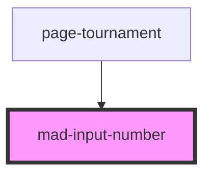

# mad-input-number

<!-- Auto Generated Below -->

## Properties

| Property      | Attribute     | Description | Type                          | Default     |
| ------------- | ------------- | ----------- | ----------------------------- | ----------- |
| `label`       | `label`       |             | `string \| undefined`         | `undefined` |
| `max`         | `max`         |             | `number \| undefined`         | `undefined` |
| `min`         | `min`         |             | `null \| number \| undefined` | `0`         |
| `placeholder` | `placeholder` |             | `string`                      | `undefined` |
| `readonly`    | `readonly`    |             | `boolean \| undefined`        | `undefined` |
| `step`        | `step`        |             | `number \| undefined`         | `undefined` |
| `value`       | `value`       |             | `number \| undefined`         | `undefined` |

## Events

| Event             | Description | Type                              |
| ----------------- | ----------- | --------------------------------- |
| `madNumberChange` |             | `CustomEvent<{ value: string; }>` |

## Dependencies

### Used by

 - [page-tournament](../page-tournament)

### Graph

----------------------------------------------

*Built with [StencilJS](https://stenciljs.com/)*
