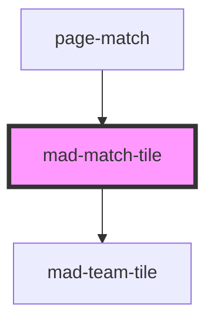

# mad-match-tile

<!-- Auto Generated Below -->

## Properties

| Property         | Attribute       | Description | Type                          | Default     |
| ---------------- | --------------- | ----------- | ----------------------------- | ----------- |
| `hostPending`    | --              |             | `Promise<TeamRow \| null>`    | `undefined` |
| `hostRank`       | `host-rank`     |             | `number \| undefined`         | `undefined` |
| `hostScore`      | `host-score`    |             | `null \| number \| undefined` | `null`      |
| `visitorPending` | --              |             | `Promise<TeamRow \| null>`    | `undefined` |
| `visitorRank`    | `visitor-rank`  |             | `number \| undefined`         | `undefined` |
| `visitorScore`   | `visitor-score` |             | `null \| number \| undefined` | `null`      |

## Dependencies

### Used by

 - [page-match](../page-match)

### Depends on

- [mad-team-tile](../team-tile)

### Graph

----------------------------------------------

*Built with [StencilJS](https://stenciljs.com/)*
