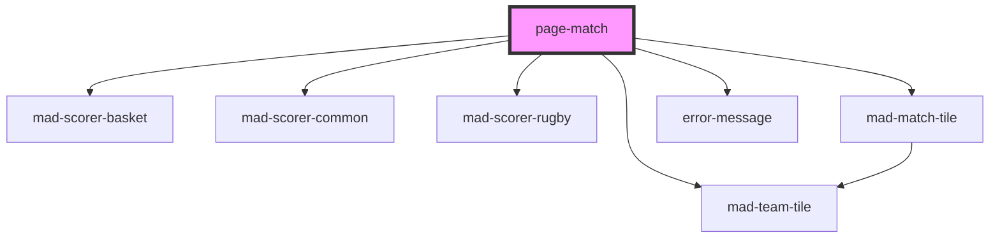

# page-match

<!-- Auto Generated Below -->

## Properties

| Property       | Attribute       | Description | Type     | Default     |
| -------------- | --------------- | ----------- | -------- | ----------- |
| `tournamentId` | `tournament-id` |             | `number` | `undefined` |

## Dependencies

### Depends on

- [mad-scorer-basket](../scorer-basket)
- [mad-scorer-common](../scorer-common)
- [mad-scorer-rugby](../scorer-rugby)
- [mad-match-tile](../match-tile)
- [mad-team-tile](../team-tile)
- [error-message](../error-message)

### Graph

----------------------------------------------

*Built with [StencilJS](https://stenciljs.com/)*
