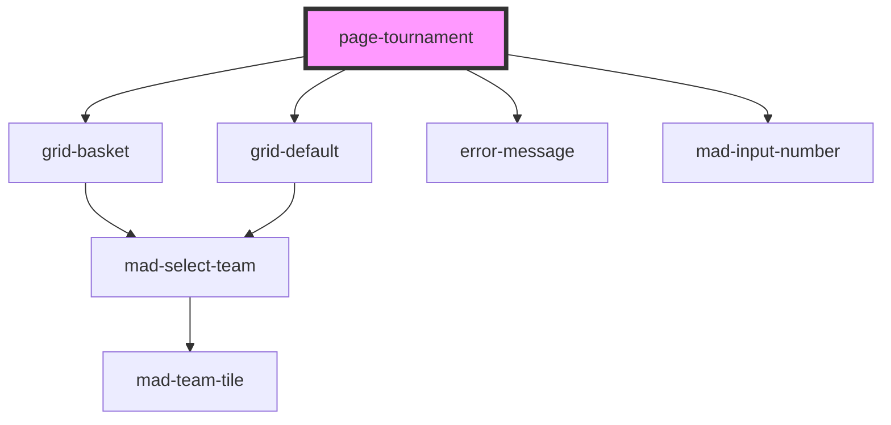

# page-tournament

<!-- Auto Generated Below -->

## Properties

| Property       | Attribute       | Description | Type     | Default     |
| -------------- | --------------- | ----------- | -------- | ----------- |
| `tournamentId` | `tournament-id` |             | `number` | `undefined` |

## Dependencies

### Depends on

- [grid-basket](../grid-basket)
- [grid-default](../grid-default)
- [error-message](../error-message)
- [mad-input-number](../input-number)

### Graph

----------------------------------------------

*Built with [StencilJS](https://stenciljs.com/)*
