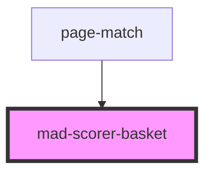

# mad-scorer-basket

<!-- Auto Generated Below -->

## Properties

| Property   | Attribute  | Description | Type                   | Default     |
| ---------- | ---------- | ----------- | ---------------------- | ----------- |
| `max`      | `max`      |             | `number \| undefined`  | `undefined` |
| `min`      | `min`      |             | `number \| undefined`  | `undefined` |
| `readonly` | `readonly` |             | `boolean \| undefined` | `undefined` |
| `value`    | `value`    |             | `number \| undefined`  | `undefined` |

## Events

| Event             | Description | Type                              |
| ----------------- | ----------- | --------------------------------- |
| `madNumberChange` |             | `CustomEvent<{ value: string; }>` |

## Dependencies

### Used by

 - [page-match](../page-match)

### Graph

----------------------------------------------

*Built with [StencilJS](https://stenciljs.com/)*
