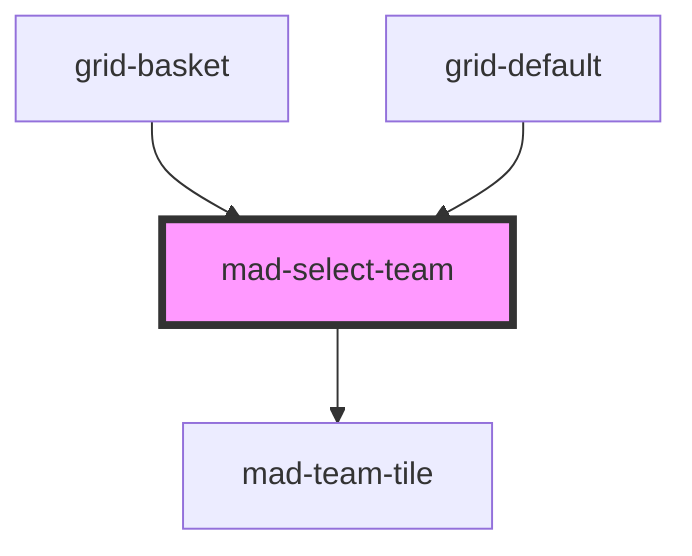

# mad-select-team

<!-- Auto Generated Below -->

## Properties

| Property           | Attribute            | Description | Type                                              | Default     |
| ------------------ | -------------------- | ----------- | ------------------------------------------------- | ----------- |
| `color`            | `color`              |             | `string`                                          | `undefined` |
| `label`            | `label`              |             | `string`                                          | `undefined` |
| `placeholder`      | `placeholder`        |             | `string`                                          | `undefined` |
| `tournamentGridId` | `tournament-grid-id` |             | `number \| undefined`                             | `undefined` |
| `type`             | `type`               |             | `"Basket" \| "Foot" \| "NBA" \| "NFL" \| "Rugby"` | `undefined` |
| `value`            | --                   |             | `GenericTeam`                                     | `undefined` |

## Events

| Event             | Description | Type                                  |
| ----------------- | ----------- | ------------------------------------- |
| `madSelectChange` |             | `CustomEvent<GridTeamOnUpdateDetail>` |

## Dependencies

### Used by

 - [grid-basket](../grid-basket)
 - [grid-default](../grid-default)

### Depends on

- [mad-team-tile](../team-tile)

### Graph

----------------------------------------------

*Built with [StencilJS](https://stenciljs.com/)*
