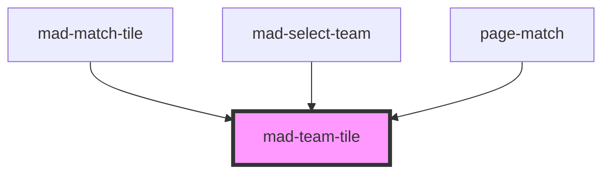

# mad-team-tile

<!-- Auto Generated Below -->

## Properties

| Property  | Attribute | Description | Type                  | Default     |
| --------- | --------- | ----------- | --------------------- | ----------- |
| `rank`    | `rank`    |             | `number \| undefined` | `undefined` |
| `reverse` | `reverse` |             | `boolean \| null`     | `undefined` |
| `team`    | --        |             | `GenericTeam \| null` | `undefined` |

## Dependencies

### Used by

 - [mad-match-tile](../match-tile)
 - [mad-select-team](../select-team)
 - [page-match](../page-match)

### Graph

----------------------------------------------

*Built with [StencilJS](https://stenciljs.com/)*
